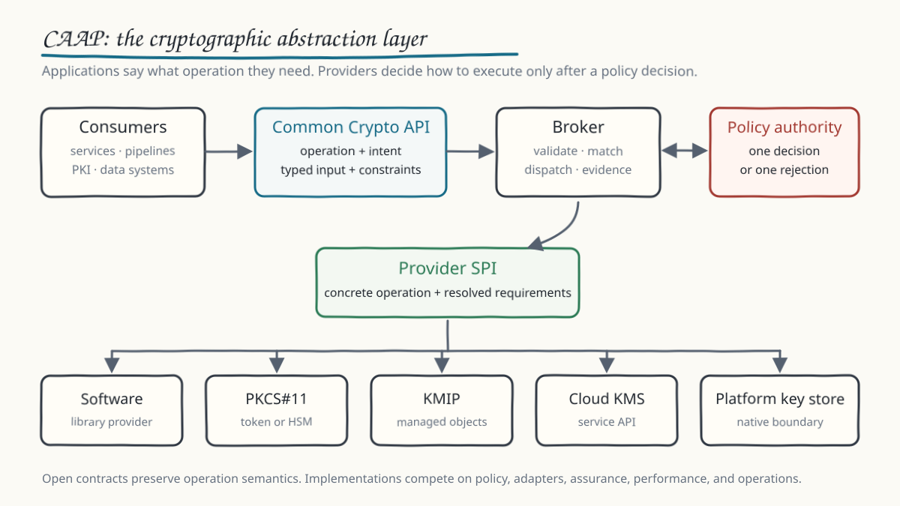
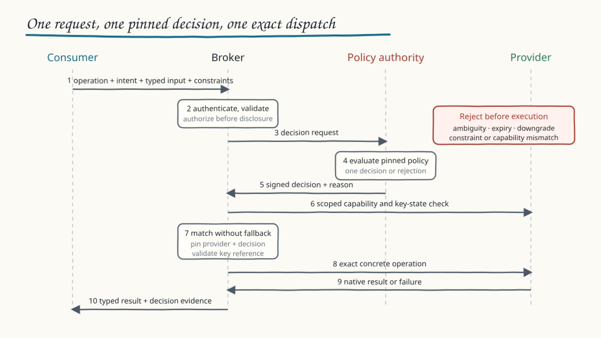
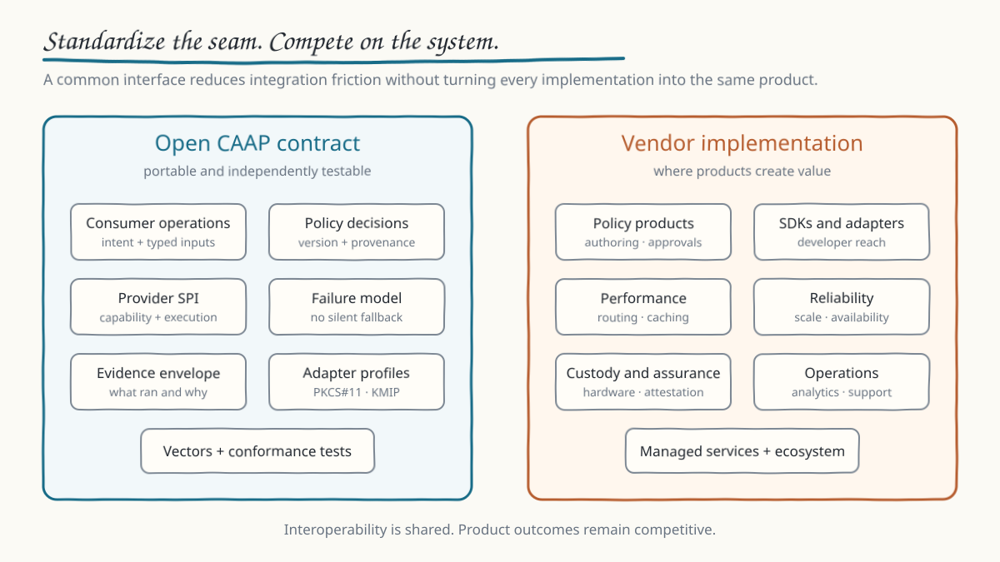

# CAAP Research Framework v1

Status: working research framework; not a standard or implementation claim

## Abstract

Applications still consume cryptography through interfaces that expose
algorithms, parameters, providers, key-store structures, and library-specific
behavior. Those details become application dependencies even when the
application only needs a stable operation such as signing, verification,
authenticated encryption, or key establishment.

The Crypto Agility Algorithm Protocol (CAAP) studies a vendor-neutral
cryptographic abstraction layer. CAAP defines the control and interaction
boundaries. The Common Crypto API is its consumer-facing contract.

The model has two contracts:

1. a northbound contract through which a consumer expresses a cryptographic
   operation, intent, input, and non-negotiable constraints; and
2. a southbound provider contract through which software libraries, HSMs,
   KMSs, key stores, and protocol adapters expose cryptographic capabilities
   and operations.

A broker enforces the boundary between them. A separate policy authority makes
the policy decision. The broker validates, matches, dispatches, and records; it
does not invent cryptographic policy or silently select a fallback.

CAAP does not claim to replace PKCS#11, KMIP, cloud KMS APIs, cryptographic
libraries, certificate protocols, or the work of existing abstraction-layer
research. It asks whether their heterogeneous execution surfaces can be
presented through a stable, testable contract without erasing security-relevant
differences.



## 1. Research question

Can two independent implementations accept the same consumer request, obtain
the same policy decision, select a compatible provider, execute the same
operation semantics, and return the same class of result or failure without
private coordination?

That question is narrower than enterprise cryptographic governance. It is also
more concrete. It can be answered with schemas, adapters, test vectors,
negative tests, and independent implementations.

## 2. Prior art and the remaining seam

IBM Research's 2026 work argues for an intent-based abstraction in which an
application states what it needs and a policy-controlled layer decides how and
where the operation runs. Its scope vocabulary groups algorithms that share an
operational input and output structure. The related papers describe policy,
providers, stable key identifiers, key evolution, and API patterns.

The Cryptographic Control Plane (CCP) working draft describes a broader
enterprise architecture in which applications call infrastructure instead of
embedding cryptographic implementation choices. Its published open questions
include the standardized API contract, conformance, reference implementation,
standards integration, and deployment patterns.

CAAP does not present either idea as its own. This framework concentrates on a
specific seam that remains useful to test:

- a small consumer contract independent of a product control plane;
- a provider service-provider interface independent of a particular backend;
- an explicit separation between policy decision and broker enforcement;
- portable failure and decision evidence;
- authenticated capability matching across local and remote providers; and
- defined adapter relationships to PKCS#11 and KMIP.

These are proposed research contributions. Novelty and interoperability remain
to be demonstrated.

## 3. Design principles

### 3.1 Express the operation, not the implementation

The normal consumer request states an operation and intent. It may state
security, custody, interoperability, or assurance constraints that cannot be
weakened. It does not select a vendor, library, device slot, KMIP object, or
cloud service endpoint.

An intent is not a vague business label. It belongs to an operation class with
defined inputs and outputs. Algorithms are substitutable within an intent only
when the operation semantics and encodings remain compatible.

### 3.2 Keep policy decision separate from enforcement

The policy authority decides which algorithm, construction, provider class,
and key properties are permitted for an authenticated context. The broker
enforces that decision against current capability and key state.

This is the control-plane and data-plane split. It prevents the broker from
becoming an undocumented algorithm recommender and allows policy engines and
brokers to evolve independently.

### 3.3 Preserve security-relevant differences

A common interface must not flatten distinctions such as message versus digest
signing, randomized versus deterministic behavior, local versus remote secret
delivery, extractable versus non-extractable keys, or one algorithm versus a
defined combined construction.

If two providers cannot preserve the same operation semantics, they are not
interchangeable for that request.

### 3.4 Use opaque references, not opaque claims

A consumer receives a logical key reference rather than provider coordinates
or key material. The reference is resolved inside an authorized context.

Opacity does not prove hardware protection, non-extractability, attestation,
or portability. Those are explicit properties with evidence requirements.

### 3.5 Fail explicitly

Policy ambiguity, inactive policy, downgrade, authorization failure,
capability mismatch, invalid key state, and provider unavailability are
different failures. The broker reports them as different failures and never
silently substitutes an algorithm or provider.

### 3.6 Make decisions reproducible

Every result identifies the request, API version, policy profile and version,
algorithm or construction identifier, provider reference available to
authorized audit systems, key reference where applicable, outcome, and timing.

## 4. Logical architecture

```text
Consumer
   |
   | Common Crypto API
   | operation + intent + input + constraints
   v
Broker / policy enforcement point <----> Policy authority / decision point
   |
   | Provider SPI
   | concrete operation + resolved decision
   v
Provider adapter
   |
   +-- software library
   +-- PKCS#11 token or HSM
   +-- KMIP server
   +-- cloud KMS
   +-- platform key store
```

### Consumer

The consumer authenticates, supplies typed operation input, expresses intent
and minimum constraints, and retains a stable request identifier for safe
correlation. It does not depend on a provider-specific key location.

### Policy authority

The policy authority evaluates authenticated caller and workload context,
intent, operation, constraints, lifecycle time, and approved policy. It returns
one decision or one rejection. It owns decision intelligence.

### Broker

The broker authenticates and authorizes the request, pins the decision,
resolves logical references, matches provider capability, dispatches the exact
operation, normalizes the result, and records evidence. It owns bounded
operational intelligence.

### Provider adapter

The provider adapter translates the provider contract to one backend. It
reports scoped capability, preserves key custody and authorization, maps
errors, and exposes backend evidence without leaking credentials or secret key
material.

## 5. Northbound Common Crypto API

The initial research surface contains two discovery and evaluation operations
and five execution operations.

| Operation | Purpose |
| --- | --- |
| `GetCapabilities` | Return the caller-scoped Common Crypto API capabilities, not a raw backend inventory |
| `ResolvePolicy` | Evaluate a request without performing a cryptographic operation |
| `GenerateKeyPair` | Resolve creation intent and return an opaque key reference plus non-secret metadata |
| `Sign` | Sign explicitly typed input with an authorized key reference |
| `Verify` | Verify explicitly typed input using a key reference or typed public material |
| `Encapsulate` | Perform an approved key-encapsulation operation with explicit secret-delivery semantics |
| `Decapsulate` | Decapsulate through an authorized key reference with explicit secret-delivery semantics |

Derivation, authenticated encryption, wrapping, unwrapping, import, export,
destruction, streaming, and successor-key operations remain candidate
extensions. They should not be placed in the base profile until their
authorization, idempotency, and data semantics are defined.

### Request envelope

```json
{
  "apiVersion": "0.1.0-experimental",
  "requestId": "req:build:000184",
  "operation": "Sign",
  "intent": "artifact-signing",
  "expectedPolicy": {
    "profileId": "artifact-signing",
    "profileVersion": "2026-08-04"
  },
  "minimumConstraints": {
    "keyProtection": "non-exportable"
  },
  "input": {
    "keyRef": "keyref:release:primary",
    "inputType": "message",
    "payloadRef": "payload:sha256:example"
  }
}
```

This is illustrative. Payload transport, canonical encoding, authentication,
and the meaning of individual constraints require a normative binding.

### Response envelope

A success returns the request and operation, pinned policy reference, selected
algorithm or construction identifier, provider reference, key reference,
typed result, and timestamps. A rejection returns the same correlation context
and a structured error without an execution result.

## 6. Policy decision contract

The policy contract is smaller than a complete policy language. It defines the
information that must cross the decision boundary:

- policy profile and version;
- decision identifier;
- authenticated subject and workload context references;
- intent and operation;
- required algorithm or construction identifier;
- permitted provider classes and required key properties;
- effective and expiry times;
- decision outcome and reason codes;
- provenance and integrity evidence; and
- data needed to reproduce the decision without exposing unrelated policy.

Rule authoring, risk scoring, approvals, exception workflows, and the policy
language remain implementation choices. A vendor may differentiate there
without changing the decision contract.

## 7. Southbound provider contract

The provider service-provider interface needs these capability groups:

- describe authenticated, scoped capabilities;
- generate or locate a key under resolved requirements;
- execute supported cryptographic operations;
- report key state and non-secret metadata;
- return evidence for claimed properties when defined; and
- map native failures to CAAP categories while retaining authorized diagnostic
  detail.

The provider receives a concrete resolved operation. It does not reinterpret
the consumer's business intent or weaken the broker's decision.

### PKCS#11

A PKCS#11 adapter can map provider operations to token sessions, mechanisms,
objects, and attributes. A compatibility module that presents CAAP as a token
is a separate experiment. It cannot represent every intent or constraint, and
“no code change” must be demonstrated for each supported application profile.

### KMIP

A KMIP adapter can map provider operations to managed objects, attributes,
profiles, and cryptographic operations. A broker logical key reference maps to
a KMIP Unique Identifier only inside an authorized provider context.

KMIP remains responsible for its managed-object and wire semantics. CAAP
resolves intent before KMIP dispatch and provides a common consumer and policy
boundary above it. A KMIP capability is not authorization, and optional KMIP
features are not assumed across implementations.

## 8. Broker execution sequence



1. Authenticate the caller and establish tenant and workload context.
2. Validate version, request identifier, freshness, operation, intent, input
   type, and minimum constraints.
3. Authorize the operation before provider details or key state are exposed.
4. Obtain one decision from an identified policy authority or a verified,
   pinned policy profile.
5. Reject an absent, inactive, ambiguous, rolled-back, or incompatible
   decision.
6. Resolve any logical key reference and validate current key state.
7. Match the decision against authenticated, fresh-enough provider capability.
8. Dispatch exactly the resolved operation.
9. Return a typed result or structured error.
10. Emit the minimum decision and execution evidence without secrets.

## 9. Failure model

| Category | Meaning |
| --- | --- |
| `INVALID_REQUEST` | The request cannot be interpreted safely |
| `UNAUTHORIZED` | The authenticated caller cannot perform the operation |
| `POLICY_NOT_FOUND` | No applicable policy exists |
| `POLICY_AMBIGUOUS` | More than one incompatible decision remains |
| `POLICY_INACTIVE` | The policy is not yet effective, expired, retired, or withdrawn |
| `CONSTRAINT_MISMATCH` | The decision cannot meet a non-negotiable constraint |
| `CAPABILITY_MISMATCH` | No allowed provider can preserve the required semantics |
| `KEY_STATE_INVALID` | The key is absent, inactive, revoked, destroyed, or incompatible |
| `PROVIDER_UNAVAILABLE` | The selected provider cannot currently execute |
| `OPERATION_FAILED` | Execution failed without a safer specific category |

Retry behavior is operation-specific. A request identifier alone does not make
key generation or signing safe to repeat.

## 10. Combined and post-quantum constructions

CAAP may carry a registered identifier for a combined construction. The broker
must not create a construction by running two algorithms and concatenating the
outputs.

Before a combined operation can be interoperable, an external or separately
reviewed definition must fix constituent algorithms, parameter sets,
composition rule, encoding, verification behavior, partial-failure behavior,
and security assumptions. Provider dispatch is an implementation detail after
those semantics exist.

## 11. Deployment invariance

The same logical contracts may be implemented as an in-process library, local
daemon, sidecar, central service, or tiered system. Placement changes latency,
availability, identity, cache, and compromise boundaries. It must not change
the operation semantics.

No topology is the default in this research version.

## 12. Open core and vendor differentiation



The portable layer should include:

- operation and intent semantics;
- request, decision, provider, response, and error contracts;
- versioning and compatibility rules;
- key-reference invariants;
- policy provenance and failure requirements;
- minimum audit vocabulary;
- provider profiles for standards such as PKCS#11 and KMIP; and
- test vectors, negative tests, and conformance profiles.

Vendors can differentiate through policy authoring, packaged policy content,
developer tooling, SDKs, adapters, performance, routing, availability,
hardware, custody, attestation, analytics, orchestration, managed services,
and support.

An open contract lowers integration friction. It does not remove those product
layers.

## 13. Evaluation plan

Framework v1 should be evaluated through one narrow profile before its scope
grows.

1. Define `artifact-signing` input and output semantics.
2. Publish one machine-readable northbound contract and provider contract.
3. Implement one consumer and one broker.
4. Implement a software provider and a materially different PKCS#11- or
   KMIP-backed provider.
5. Run identical consumer requests against both implementations.
6. Publish positive vectors and negative cases for ambiguity, constraint
   mismatch, key state, and provider capability.
7. Measure broker overhead without claiming a universal performance result.
8. Ask an independent implementation to reproduce the behavior.

## 14. Non-claims

Framework v1 does not claim:

- standards-track status or industry adoption;
- novelty over IBM, CCP, or other prior art;
- a complete or normative wire binding;
- interoperable combined cryptography;
- safe algorithm substitution across incompatible operation shapes;
- universal provider or key portability;
- implementation, performance, certification, or product support; or
- coverage of boot roots, constrained devices, or line-rate data paths.

## 15. Open questions

- Which intent vocabulary is small enough to be stable and precise enough to
  preserve operation semantics?
- Should the normative binding use Protocol Buffers, OpenAPI, CDDL, or another
  schema and transport combination?
- How are policy profiles signed, distributed, expired, and protected against
  rollback?
- What is the minimum provider-attestation vocabulary that does not create a
  competing validation scheme?
- Which logical key-reference semantics can survive provider or successor-key
  changes without misleading the consumer?
- Which KMIP and PKCS#11 profiles can be mapped without semantic loss?
- How should provider identity be exposed to callers, operators, and auditors?
- What evidence is sufficient for an independent conformance claim?

## References

- [IBM Research, It is time for cryptography to get its own abstraction layer](https://research.ibm.com/blog/cryptography-abstraction-layer)
- [An Assessment Framework for Application-Level Cryptographic Agility](https://arxiv.org/abs/2606.13425)
- [Intent-Based Cryptographic API Design for Cryptographic Agility](https://arxiv.org/abs/2606.13445)
- [Cryptographic Control Plane Standard, version 0.9 working draft](https://ccp-standard.org/)
- [NIST CSWP 39 update 1, Considerations for Achieving Crypto Agility](https://csrc.nist.gov/pubs/cswp/39/upd1/considerations-for-achieving-crypto-agility/final)
- [OASIS KMIP Specification Version 2.1](https://docs.oasis-open.org/kmip/kmip-spec/v2.1/os/kmip-spec-v2.1-os.html)
- [OASIS KMIP Profiles Version 2.1](https://docs.oasis-open.org/kmip/kmip-profiles/v2.1/os/kmip-profiles-v2.1-os.html)
